# Architecture Documentation

## System Overview

The SOP QA Tool is designed as a modular, dual-mode system that can operate either with AWS cloud services or in a completely local environment. The architecture follows microservices principles with clear separation of concerns.

## High-Level Architecture

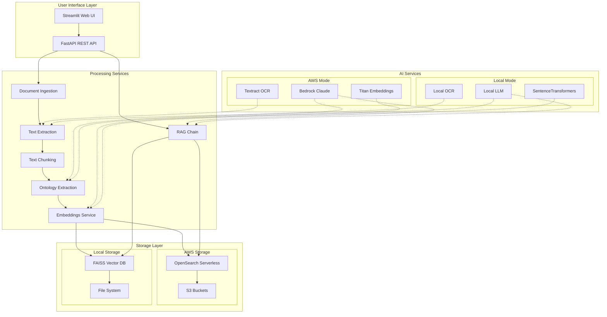

## Component Architecture

### 1. User Interface Layer

#### Streamlit Web UI (`sop_qa_tool/ui/`)
- **Purpose**: Provides conversational interface for document upload and querying
- **Key Components**:
  - Chat interface with message history
  - Document upload forms
  - Filtering controls (role, equipment, document type)
  - Export functionality (CSV, Markdown)
  - SOP card display with structured data

#### FastAPI REST API (`sop_qa_tool/api/`)
- **Purpose**: Provides programmatic access to all system functionality
- **Endpoints**:
  - `POST /ingest` - Document ingestion
  - `POST /ask` - Question answering
  - `GET /sources` - Document management
  - `GET /health` - System health check
  - `POST /reindex` - Index rebuilding

### 2. Processing Services

#### Document Ingestion Service (`sop_qa_tool/services/document_ingestion.py`)

**Key Features**:
- SSRF protection for URL inputs
- File type validation and size limits
- Retry logic with exponential backoff
- Progress tracking for bulk operations

#### Text Processing Pipeline
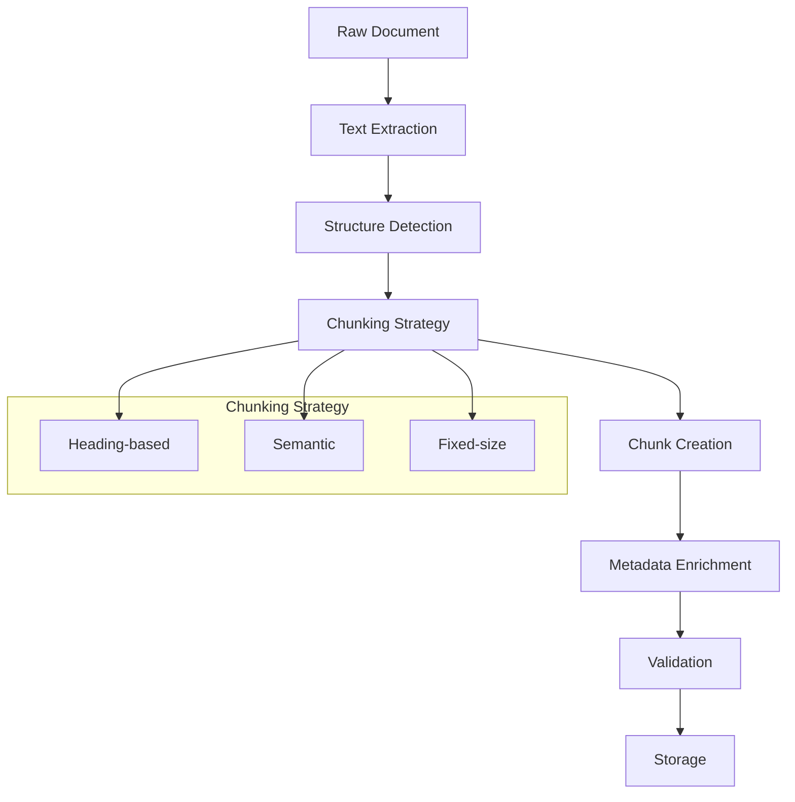

#### Ontology Extraction Service (`sop_qa_tool/services/ontology_extractor.py`)
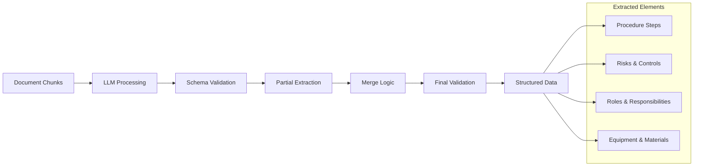

### 3. RAG (Retrieval-Augmented Generation) Pipeline

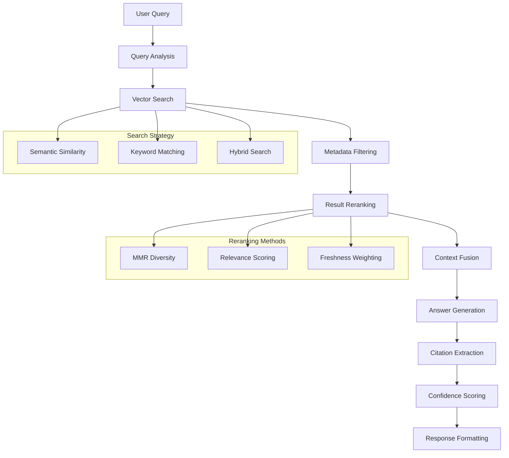

## Data Flow Architecture

### Document Ingestion Flow
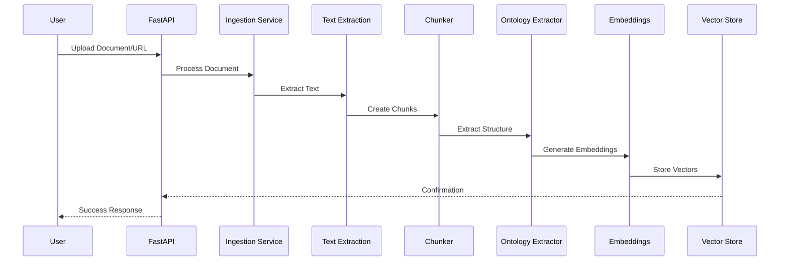

### Query Processing Flow
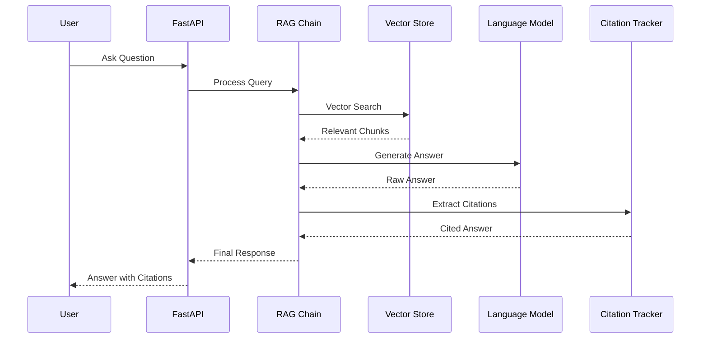

## Storage Architecture

### AWS Mode Storage
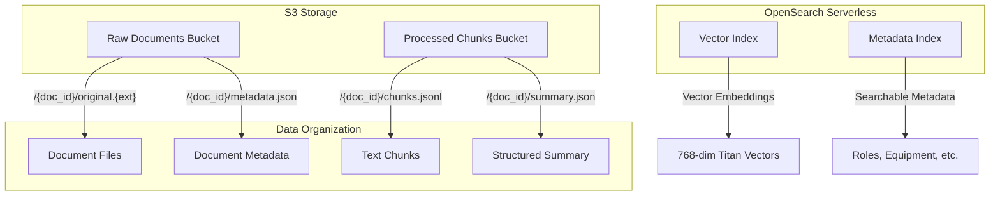

### Local Mode Storage
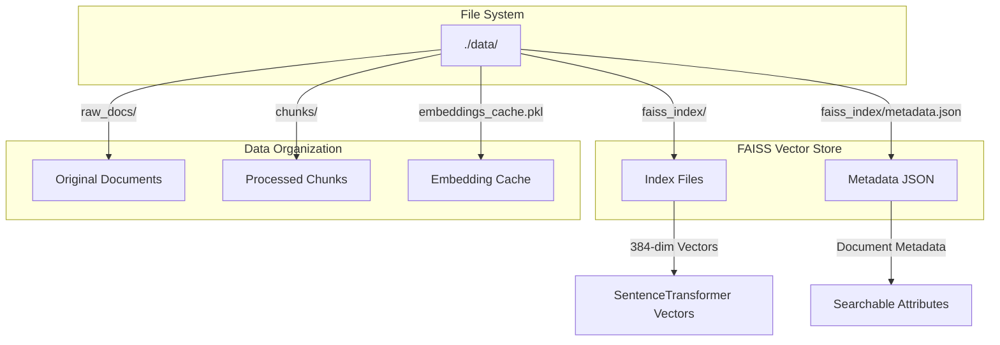

## Security Architecture

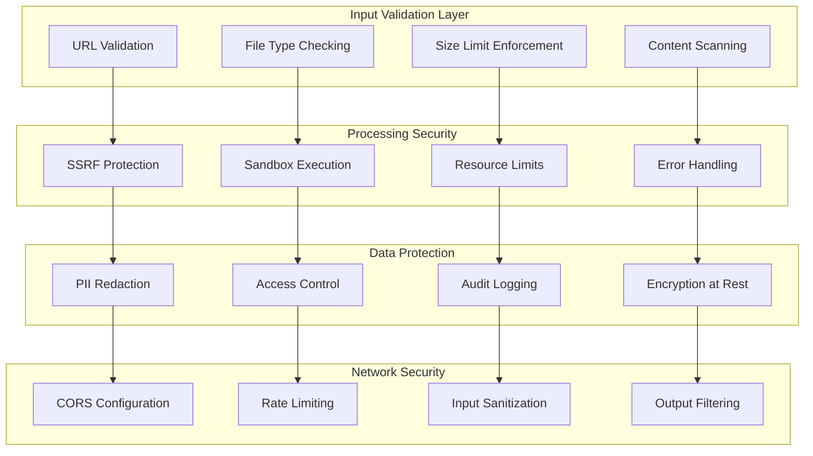

## Deployment Architecture

### Local Deployment
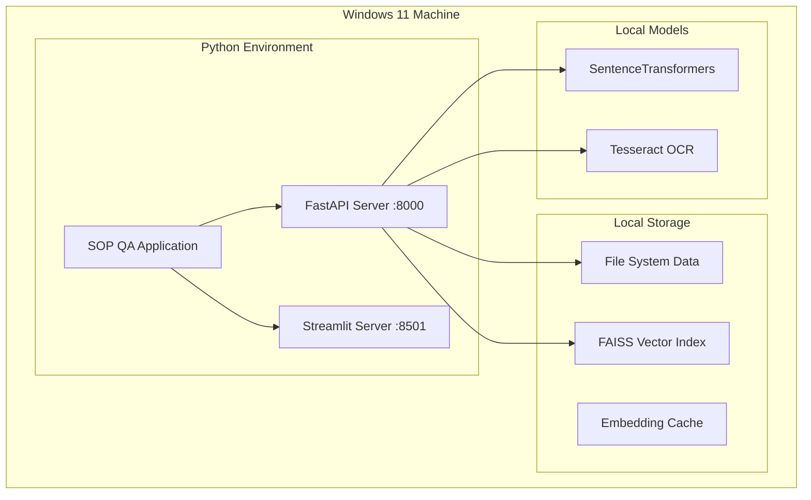

### AWS Deployment
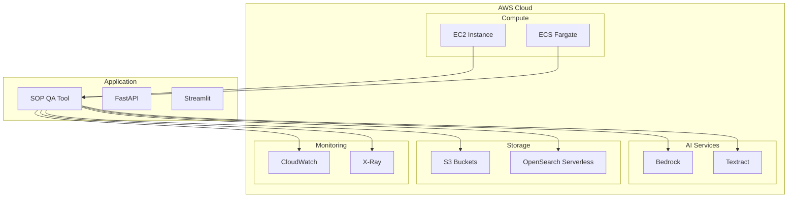

## Configuration Management

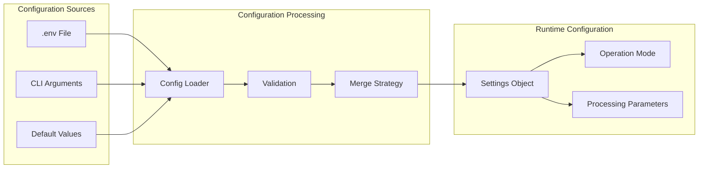

## Performance Considerations

### Scalability Patterns
- **Horizontal Scaling**: Multiple API instances behind load balancer
- **Vertical Scaling**: Increased memory/CPU for local processing
- **Caching Strategy**: Multi-level caching (embeddings, results, metadata)
- **Async Processing**: Background document ingestion with progress tracking

### Memory Management
- **Streaming Processing**: Process large documents in chunks
- **Lazy Loading**: Load models and data on-demand
- **Cache Eviction**: LRU cache for embeddings and results
- **Resource Monitoring**: Track memory usage and implement limits

### Optimization Strategies
- **Batch Processing**: Group similar operations for efficiency
- **Connection Pooling**: Reuse database and API connections
- **Compression**: Compress stored embeddings and metadata
- **Indexing**: Optimize vector search with appropriate algorithms

## Error Handling and Resilience

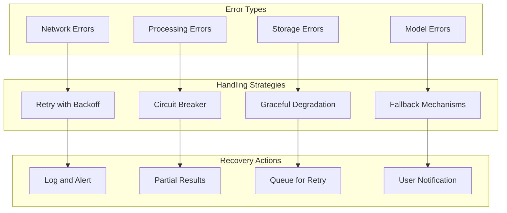

## Monitoring and Observability

### Metrics Collection
- **Performance Metrics**: Response times, throughput, error rates
- **Resource Metrics**: Memory usage, CPU utilization, disk space
- **Business Metrics**: Documents processed, queries answered, user satisfaction
- **Health Metrics**: Service availability, dependency status

### Logging Strategy
- **Structured Logging**: JSON format with consistent fields
- **Log Levels**: DEBUG, INFO, WARN, ERROR with appropriate filtering
- **Correlation IDs**: Track requests across service boundaries
- **Audit Trail**: Security events and data access patterns

### Alerting Rules
- **High Error Rate**: >5% errors in 5-minute window
- **High Latency**: P95 response time >10 seconds
- **Resource Exhaustion**: Memory usage >80% or disk space >90%
- **Service Unavailability**: Health check failures

This architecture provides a robust, scalable foundation for the SOP QA Tool while maintaining flexibility for both cloud and local deployments.