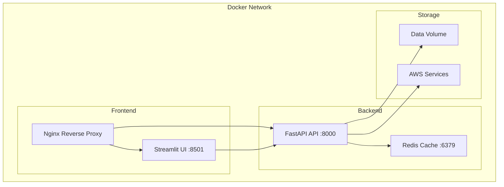

# Docker Deployment Guide

This guide covers containerized deployment of the SOP QA Tool using Docker and Docker Compose.

## Prerequisites

- Docker Engine 20.10+
- Docker Compose 2.0+
- 8GB RAM minimum (16GB recommended)
- 10GB free disk space

## Quick Start

### Local Development

1. **Clone the repository:**
   ```bash
   git clone <repository-url>
   cd sop-qa-tool
   ```

2. **Create environment file:**
   ```bash
   cp .env.template .env
   # Edit .env as needed
   ```

3. **Start development environment:**
   ```bash
   docker-compose -f docker-compose.dev.yml up -d
   ```

4. **Access the application:**
   - UI: http://localhost:8501
   - API: http://localhost:8000
   - Jupyter: http://localhost:8888

### Production Deployment

1. **Build and start services:**
   ```bash
   docker-compose up -d
   ```

2. **With reverse proxy (recommended):**
   ```bash
   docker-compose --profile production up -d
   ```

## Configuration

### Environment Variables

Create a `.env` file with the following variables:

```bash
# Operation Mode
MODE=local  # or 'aws'

# AWS Configuration (for AWS mode)
AWS_REGION=us-east-1
AWS_PROFILE=default
BEDROCK_MODEL_ID=anthropic.claude-3-sonnet-20240229-v1:0
TITAN_EMBEDDINGS_ID=amazon.titan-embed-text-v2:0
OPENSEARCH_ENDPOINT=https://your-opensearch-endpoint.us-east-1.aoss.amazonaws.com
S3_RAW_BUCKET=your-raw-bucket
S3_CHUNKS_BUCKET=your-chunks-bucket

# Processing Configuration
CHUNK_SIZE=800
CHUNK_OVERLAP=150
MAX_FILE_SIZE_MB=50
TOP_K_RETRIEVAL=5
CONFIDENCE_THRESHOLD=0.35

# Security Settings
ALLOWED_FILE_TYPES=pdf,docx,html,txt
ENABLE_PII_REDACTION=false
ENABLE_SSRF_PROTECTION=true

# Logging
LOG_LEVEL=INFO
ENABLE_DEBUG=false
```

### Docker Compose Profiles

The deployment supports multiple profiles:

- **Default**: API and UI services only
- **Production**: Includes Redis cache and Nginx reverse proxy
- **Development**: Hot reload, Jupyter notebook, debug mode

## Service Architecture



## Deployment Scenarios

### Scenario 1: Local Development

**Use Case**: Development and testing

**Configuration:**
```bash
# Start development environment
docker-compose -f docker-compose.dev.yml up -d

# View logs
docker-compose -f docker-compose.dev.yml logs -f

# Stop services
docker-compose -f docker-compose.dev.yml down
```

**Features:**
- Hot reload for code changes
- Debug mode enabled
- Jupyter notebook access
- Local file system storage

### Scenario 2: Local Production

**Use Case**: Single-machine production deployment

**Configuration:**
```bash
# Start production services
docker-compose up -d

# Check service health
docker-compose ps
docker-compose logs api
docker-compose logs ui
```

**Features:**
- Optimized containers
- Health checks
- Restart policies
- Production logging

### Scenario 3: Cloud Production

**Use Case**: Cloud deployment with AWS services

**Configuration:**
```bash
# Set AWS mode
echo "MODE=aws" >> .env

# Configure AWS credentials
docker run --rm -v ~/.aws:/root/.aws:ro amazon/aws-cli configure list

# Start with production profile
docker-compose --profile production up -d
```

**Features:**
- AWS service integration
- Reverse proxy with SSL
- Redis caching
- Load balancing ready

## Volume Management

### Data Persistence

The application uses Docker volumes for data persistence:

```yaml
volumes:
  - ./data:/home/app/data  # Application data
  - ~/.aws:/home/app/.aws:ro  # AWS credentials (read-only)
```

### Backup Strategy

```bash
# Backup data volume
docker run --rm -v sop-qa-tool_data:/data -v $(pwd):/backup alpine tar czf /backup/data-backup-$(date +%Y%m%d).tar.gz -C /data .

# Restore data volume
docker run --rm -v sop-qa-tool_data:/data -v $(pwd):/backup alpine tar xzf /backup/data-backup-20240101.tar.gz -C /data
```

## Monitoring and Logging

### Health Checks

All services include health checks:

```bash
# Check service health
docker-compose ps

# View health check logs
docker inspect --format='{{json .State.Health}}' sop-qa-api
```

### Log Management

```bash
# View logs
docker-compose logs -f api
docker-compose logs -f ui

# Log rotation (add to docker-compose.yml)
logging:
  driver: "json-file"
  options:
    max-size: "10m"
    max-file: "3"
```

### Metrics Collection

```bash
# Add Prometheus monitoring (optional)
version: '3.8'
services:
  prometheus:
    image: prom/prometheus
    ports:
      - "9090:9090"
    volumes:
      - ./docker/prometheus.yml:/etc/prometheus/prometheus.yml
    profiles:
      - monitoring
```

## Security Considerations

### Container Security

1. **Non-root user**: Containers run as non-root user
2. **Read-only volumes**: AWS credentials mounted read-only
3. **Network isolation**: Services communicate via Docker network
4. **Resource limits**: Memory and CPU limits configured

### Network Security

```yaml
# Add resource limits
deploy:
  resources:
    limits:
      memory: 2G
      cpus: '1.0'
    reservations:
      memory: 1G
      cpus: '0.5'
```

### Secrets Management

```bash
# Use Docker secrets for sensitive data
echo "your-secret-key" | docker secret create api_key -

# Reference in compose file
secrets:
  - api_key
```

## Scaling and Performance

### Horizontal Scaling

```yaml
# Scale API service
services:
  api:
    deploy:
      replicas: 3
    # ... other configuration
```

### Load Balancing

```bash
# Scale services
docker-compose up -d --scale api=3 --scale ui=2

# Use external load balancer
# Configure nginx upstream with multiple backends
```

### Performance Tuning

```yaml
# Optimize for performance
services:
  api:
    environment:
      - WORKERS=4
      - WORKER_CLASS=uvicorn.workers.UvicornWorker
      - MAX_REQUESTS=1000
      - MAX_REQUESTS_JITTER=100
```

## Troubleshooting

### Common Issues

1. **Port conflicts:**
   ```bash
   # Check port usage
   netstat -tulpn | grep :8000
   
   # Use different ports
   docker-compose up -d --scale api=1 -p 8001:8000
   ```

2. **Memory issues:**
   ```bash
   # Check container memory usage
   docker stats
   
   # Increase memory limits
   # Edit docker-compose.yml deploy.resources.limits.memory
   ```

3. **Volume permissions:**
   ```bash
   # Fix volume permissions
   sudo chown -R 1000:1000 ./data
   ```

4. **AWS credentials:**
   ```bash
   # Verify AWS credentials in container
   docker-compose exec api aws sts get-caller-identity
   ```

### Debug Mode

```bash
# Enable debug logging
echo "LOG_LEVEL=DEBUG" >> .env
echo "ENABLE_DEBUG=true" >> .env

# Restart services
docker-compose restart

# Access container shell
docker-compose exec api bash
docker-compose exec ui bash
```

### Service Dependencies

```bash
# Check service startup order
docker-compose logs api | grep "waiting for"

# Manual dependency check
docker-compose exec api curl -f http://localhost:8000/health
```

## Maintenance

### Updates

```bash
# Pull latest images
docker-compose pull

# Rebuild and restart
docker-compose up -d --build

# Clean up old images
docker image prune -f
```

### Database Maintenance

```bash
# Rebuild search index
docker-compose exec api python scripts/rebuild-index.py

# Clean up old data
docker-compose exec api python scripts/cleanup-old-data.py
```

### Backup and Restore

```bash
# Create backup script
#!/bin/bash
DATE=$(date +%Y%m%d_%H%M%S)
docker-compose exec api tar czf /tmp/backup_$DATE.tar.gz -C /home/app/data .
docker cp sop-qa-api:/tmp/backup_$DATE.tar.gz ./backups/
```

## Production Checklist

### Pre-deployment

- [ ] Environment variables configured
- [ ] AWS credentials available (if using AWS mode)
- [ ] SSL certificates configured (for HTTPS)
- [ ] Resource limits set appropriately
- [ ] Backup strategy implemented
- [ ] Monitoring configured

### Post-deployment

- [ ] Health checks passing
- [ ] Services accessible
- [ ] Logs flowing correctly
- [ ] Performance metrics within expected ranges
- [ ] Security scan completed
- [ ] Backup tested

### Ongoing Maintenance

- [ ] Regular security updates
- [ ] Log rotation configured
- [ ] Monitoring alerts set up
- [ ] Backup verification
- [ ] Performance optimization
- [ ] Cost monitoring (for AWS mode)

## Advanced Configuration

### Multi-stage Builds

The Dockerfile uses multi-stage builds for optimization:

```dockerfile
# Development stage with all tools
FROM python:3.11-slim as development
# ... development dependencies

# Production stage optimized for size
FROM python:3.11-slim as production
# ... minimal production setup
```

### Custom Networks

```yaml
# Custom network configuration
networks:
  frontend:
    driver: bridge
  backend:
    driver: bridge
    internal: true  # No external access
```

### External Services

```yaml
# Use external database
services:
  api:
    external_links:
      - postgres:db
    environment:
      - DATABASE_URL=postgresql://user:pass@db:5432/sopqa
```

This Docker deployment guide provides a comprehensive approach to containerizing and deploying the SOP QA Tool in various environments.